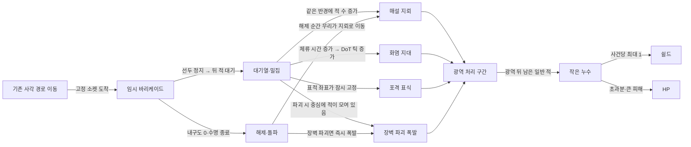

# RS-01 — 핵심 유물·바리케이드·조합 설계안

- 작성일: 2026-10-04
- 담당: 유물·바리케이드·조합 Work
- 상태: **PROPOSAL — 설계·정적 관계 검토·벡터 시각 자료 제작 완료 / 코드 구현·앱 배포·실플레이 검증 미실행**
- 최종 방향 결정: 사용자
- 메인 구현·통합·배포: 두리
- 캐릭터 기본 수치·2성 갈래·능력 데이터: 캐릭터 팀
- 작업 ID: `RS-01`
- 기준 저장소 HEAD 확인 시점: `312c8f26cfd79e4aec58ea261b79598420709ede`
- 공개 범위: 설계 문서와 문서 내 Mermaid 시각 자료만 포함. 대화 첨부 PNG/SVG는 공개 저장소에 넣지 않으며 게임 코드·원본 에셋·비공개 URL·인증정보 없음.

## 1. 한눈에 보는 결론

이 문서는 유물을 단순한 `공격력 +N%` 보너스가 아니라 **영입·합성·배치·능력 구매의 우선순위를 바꾸는 원정 규칙**으로 설계한다.

제안 결과는 다음과 같다.

1. 핵심 유물 12종을 `군단`, `집중`, `이동`, `화상`, `바리케이드`, `쉴드`, `승급 투자` 빌드로 분리했다.
2. 바리케이드는 기존 바깥 사각 경로를 바꾸지 않고 **고정 소켓에서 선두를 잠시 정지시키는 내구도형 임시 구조물**로 정의했다.
3. 파괴형 바리케이드는 `최후의 성벽`의 **길게 버티고 크게 한 번 폭발**하는 형태와 `균열 신관함`의 **짧게 막고 작게 여러 번 폭발**하는 형태로 분리했다.
4. HP는 큰 실패를 버티는 지속 자원, 쉴드는 작은 누수를 1씩 흡수하는 회복 가능한 완충 자원으로 구분했다.
5. 복제·화상 처치·이동 잔상·자동 재건의 무한 발동을 막는 공통 사건 규칙을 정의했다.
6. 첫 시험은 **웨이브 3 무료 핵심 유물 1개 선택**과 6종 수직 시험을 권장한다. 유물에 고철 가격을 붙여 영입·능력 구매와 경쟁시키는 방식은 권장하지 않는다.

## 2. 확인한 기준과 충돌 경계

### 2.1 이번 작업에서 따르는 사용자 확정 방향

- 안쪽 배치는 4×4, 적은 바깥 사각 경로를 돈다.
- 비비·탄코·로코 3종을 편성하며 시작 시 그중 1명만 무작위 소환된다.
- 같은 영웅 1성 3개로 2성 1개를 합성하고, 남길 개체와 2성 갈래를 선택한다.
- 현재 3성 전투는 잠겨 있으며 이 문서가 3성 구현을 승인하지 않는다.
- 처치로 얻는 자원으로 영웅을 영입하고, 영웅별·성급별 능력을 구매한다.
- 기본 사거리는 짧게 두고 배치·갈래·성장으로 차이를 크게 만드는 방향이다.
- 수동 궁극기나 별도 전투 발동 버튼을 추가하지 않는다.
- 유물·바리케이드·쉴드는 모두 **새 제안**이며 현재 구현으로 기록하지 않는다.

### 2.2 확인한 저장소 기준

- `docs/WORK_START_HERE.md`
- `docs/CURRENT_IMPLEMENTATION.md`
- `docs/work-orders/2026-10-04-v03-coordination.md`
- `docs/work-orders/2026-10-04-planning-v03.md`
- `docs/work-orders/2026-10-04-design-v03.md`
- `docs/proposals/2026-10-04_workshop-v04-release.md`
- `docs/proposals/2026-10-04_approved-hero-ability-merge-experiment.md`
- `docs/proposals/2026-10-04_design_DS-08_ability-draft-v2.md`
- `docs/proposals/2026-10-03_v03-canonical-decisions.md`
- `docs/proposals/2026-10-03_v09-canonical-speed-recruitment-addendum.md`

최신 실험은 v0.4.2이며, v0.4에서 4×4·수동 3→2성 합성·3명 편성 후 1명 무작위 시작·처치 고철·유료 능력 후보가 구현됐다. 유물·바리케이드·쉴드·3성 전투는 구현되지 않았다.

과거 v0.3 기준의 3×3, 첫 중복 즉시 승급, 경험치 카드 규칙은 역사적 기록이다. 이번 RS-01은 사용자의 최신 지시와 v0.4 흐름을 우선한다.

### 2.3 캐릭터 팀 결과에서 유지할 경계

- 1성 전용 능력은 현재·미래 1성에 적용하고 기본적으로 2성에 자동 이전하지 않는다.
- 파티 전체, 해당 영웅 전 성급, 1성 전용, 2성 전용, 갈래 전용 범위를 섞지 않는다.
- 추가탄·복제·전염·폭발은 자기 자신을 다시 발동시키지 않는다.
- 적 1기의 사망은 처치·고철·성장·충전에서 정확히 한 번만 집계한다.
- 비비 화염/저격, 탄코 폭발/소이, 로코 유도/관통의 정확한 기본 수치와 승급 수치는 캐릭터 팀이 소유한다.
- `기억의 모루`처럼 기존 경계를 의도적으로 바꾸는 유물은 **예외 규칙**으로만 제공하며 기본 승급 규칙을 덮어쓰지 않는다.

## 3. 핵심 유물 설계 원칙

핵심 유물은 다음 질문 중 최소 두 개에 답해야 한다.

- 다음 고철로 어느 영웅을 더 영입할 것인가?
- 지금 1성 셋을 합성할 것인가, 군단으로 남길 것인가?
- 4×4 중 어느 칸을 비우거나 붙여 놓을 것인가?
- 어느 영웅·성급·갈래 능력을 먼저 구매할 것인가?
- 누수를 막을 것인가, 일부를 쉴드로 감수하고 화력을 키울 것인가?

공통 제약은 다음과 같다.

- 핵심 유물은 원정당 같은 ID를 한 번만 획득한다.
- 단순 수치 상승은 보조 효과로만 사용한다.
- 유물 한 장에 핵심 판정은 최대 2개로 제한한다.
- 모든 유물에 억지 페널티를 붙이지 않는다. 빈칸·두 칸 점유·합성 지연·소켓 선택 같은 **자연스러운 기회비용**을 우선한다.
- 복제 공격과 소환 공격은 피해를 줄 수 있지만 원본 트리거를 다시 만들지 않는다.
- 아래 수치는 모두 첫 프로토타입을 위한 시험값이며 확정 밸런스가 아니다.

## 4. 핵심 유물 12종

### R01. 쌍둥이 거울

- **외형:** 가운데가 세로로 갈라진 은빛 전신거울. 왼쪽과 오른쪽 면에 서로 다른 2성 갈래 문양이 비친다.
- **핵심 규칙:** 2성 합성 시 인접한 빈칸 하나를 추가로 지정해 두 갈래 반사체를 함께 배치한다. 두 반사체는 하나의 `linked_group`이며 공유 공격 주기마다 각 갈래 공격을 시험값 60% 위력으로 발사한다.
- **키우고 싶은 부대:** 한 영웅의 두 갈래를 동시에 경험하는 혼합 포대. 예: 비비 화염으로 무리를 정리하면서 저격으로 강적을 마무리.
- **달라지는 결정:** 합성 전에 인접 두 칸을 확보해야 하며, 공용·2성 공통 능력과 갈래 전용 능력의 구매 대상을 나눠 본다.
- **보조 능력:** 한 반사체의 표적이 사라지면 다른 반사체의 표적을 이어받을 수 있다.
- **약점·상한:** 원정당 연결 그룹 1개. 두 반사체의 공격은 공격 카운터에서 한 사건으로 집계한다. 파티 인원·지휘관 수·복제 조건에서 둘로 세지 않는다.

### R02. 왕의 깃발

- **외형:** 황동 톱니 장식과 세 개의 짧은 리본이 달린 작은 지휘 깃발.
- **핵심 규칙:** 2성 하나를 지휘관으로 지정한다. 같은 영웅 1성이 지휘 범위 안에 있으면 지휘관의 마지막 `natural_basic` 공격을 0.25초 뒤 시험값 30% 위력으로 모방한다.
- **키우고 싶은 부대:** 합성을 서두르지 않고 1성을 여러 명 남기는 군단 빌드.
- **달라지는 결정:** 중복 영입을 2성 하나와 1성 다수로 분배하며, 지휘관 주변 칸을 병력에 할당한다.
- **보조 능력:** 모방 대기 중 지휘관 표적이 사망하면 가장 가까운 유효 적으로 한 번 재탐색한다.
- **약점·상한:** 지휘 범위 1성 최대 4명, 깃발 발동 내부 제한 2초. 모방 공격은 다시 모방·복제·잔상·유물 카운터를 만들지 않는다.

### R03. 공허의 왕관

- **외형:** 안쪽이 비어 있고 네 방향으로 검은 수정 이빨이 뻗은 왕관.
- **핵심 규칙:** 영웅 하나를 왕관 주인으로 지정한다. 상하좌우 빈칸마다 `공허문` 1개를 만들고, 왕관 주인의 공격 때 공허문 하나가 순서대로 가장 가까운 경로에 시험값 45% 보조탄을 발사한다.
- **키우고 싶은 부대:** 많은 유닛보다 한 영웅과 그 능력 구매에 집중하는 단일 캐리 빌드.
- **달라지는 결정:** 왕관 주변 네 칸을 비우고 다른 영웅을 외곽으로 밀어낸다. 중복 영입과 능력 구매를 한 영웅에 집중한다.
- **보조 능력:** 공허문 4개가 모두 열리면 보조탄이 표적 사망 시 한 번 재탐색한다.
- **약점·상한:** 왕관 주인 1명, 공허문 최대 4개. 보조탄은 복제·처치 충전·지휘 모방을 발동하지 않는다. 빈칸 자체가 핵심 비용이다.

### R04. 유령역의 표

- **외형:** 오래된 승차권에 이전 칸의 좌표가 흐릿한 도장으로 남는다.
- **핵심 규칙:** 표를 가진 실제 영웅이 플레이어 이동으로 칸을 바꾸면 이전 칸에 4초 잔상을 만든다. 잔상은 그 영웅의 다음 자연 기본공격을 시험값 55%로 한 번 재현한다.
- **키우고 싶은 부대:** 짧은 기본 사거리를 이동으로 보완하고 네 변을 순찰하는 이동 포대.
- **달라지는 결정:** 전투 중 또는 준비 시간의 이동 경로, 빈칸 확보, 어느 영웅에게 이동 관련 능력을 구매할지가 중요해진다.
- **보조 능력:** 잔상은 생성 시점의 방향이 아니라 공격 순간의 유효 표적을 찾는다.
- **약점·상한:** 영웅당 활성 잔상 2개, 이동 판정 2초 제한. 강제 이동·잔상 공격·복제 공격은 잔상을 만들지 않는다. 한 번의 교환 조작에서 표 보유자당 잔상 1개만 생성한다.

### R05. 불사조의 알

- **외형:** 검은 금속 알 내부에 주황색 균열이 처치 수에 따라 차오른다.
- **핵심 규칙:** `hero_burn`으로 귀속된 화상 처치 12회마다 불사조가 자동으로 적이 가장 많은 경로 변을 쓸고 지나가 광역 피해와 기본 화상 1회를 적용한다.
- **키우고 싶은 부대:** 비비 화염·탄코 소이와 화상 지속·전염 능력을 모으는 화상 군단.
- **달라지는 결정:** 화상 영웅 영입과 갈래 선택, 화상 지속·범위·전염 능력 구매가 최우선이 된다.
- **보조 능력:** 12를 넘긴 충전은 버리지 않고 다음 알에 남긴다.
- **약점·상한:** 불사조·유물 화상·전염 세대 1 이후의 처치는 알을 충전하지 않는다. 적 1기당 충전 1회, 발동 내부 제한 8초.

### R06. 최후의 성벽

- **외형:** 철판과 황동 버팀대를 겹친 높은 장벽. 받은 충격이 붉은 균열로 저장된다.
- **핵심 규칙:** 선택한 경로 소켓에 웨이브당 고내구 바리케이드 1개를 설치한다. 받은 실제 구조물 피해를 상한까지 저장하고, 내구도 0으로 파괴되면 저장 충격과 현재 밀집 수에 비례해 크게 폭발한다.
- **키우고 싶은 부대:** 오래 붙잡아 화염 틱과 느린 포격을 충분히 넣고 마지막에 큰 폭발로 정리하는 성채 빌드.
- **달라지는 결정:** 어느 변을 주 방어선으로 정할지, 장벽 앞에 화염·포격 영웅을 둘지, 내구도·밀집 관련 능력을 살지가 달라진다.
- **보조 능력:** 장벽이 살아 있는 동안 그 좌표의 포격 표식 유지시간이 늘어난다.
- **약점·상한:** 활성 장벽 1개, 웨이브당 설치 1회. 보스 정지는 최대 1.2초. 시간 종료나 웨이브 종료로 철거되면 대폭발하지 않는다. `균열 신관함`과 상호 배타.

### R07. 균열 신관함

- **외형:** 금이 간 공구함 안에 짧은 도화선과 접이식 장벽 부품이 들어 있다.
- **핵심 규칙:** 저내구 바리케이드가 파괴될 때 고정 피해의 작은 폭발을 일으킨다. 건설 재고가 남아 있으면 같은 소켓에 시험값 4초 뒤 자동 재건한다.
- **키우고 싶은 부대:** 오래 버티기보다 적을 짧게 모으고 여러 번 파괴해 지뢰·폭발을 반복하는 철거 빌드.
- **달라지는 결정:** 내구도보다 재건·지뢰·파괴 폭발 능력을 구매하며, 적이 가장 자주 지나가는 변을 선택한다.
- **보조 능력:** 재건 직후 첫 번째 밀집 조건은 적 2명으로 한 번 완화할 수 있다.
- **약점·상한:** 웨이브당 자동 재건 2회, 같은 소켓 재설치 잠금 4초. 재건은 새 건설 재고를 소비하며 재고를 생성하지 않는다. `최후의 성벽`과 상호 배타.

### R08. 측량사의 포격종

- **외형:** 지도 눈금이 새겨진 작은 종과 좌표추가 달린 관측 장비.
- **핵심 규칙:** 바리케이드가 서로 다른 적 3명을 붙잡으면 해당 좌표에 포격 표식을 만든다. 다음 `artillery` 태그 자연 공격은 원래 자동 공격 주기를 유지한 채 그 좌표를 우선 조준한다.
- **키우고 싶은 부대:** 탄코 폭발처럼 느리지만 넓은 공격을 확실히 맞히는 포격 진형.
- **달라지는 결정:** 탄코 영입·폭발 갈래·폭발 반경 구매와 바리케이드 소켓을 한 세트로 선택한다.
- **보조 능력:** 장벽이 먼저 파괴돼도 표식은 시험값 1.5초 남아 해제 직후 무리를 노릴 수 있다.
- **약점·상한:** 활성 표식 1개, 내부 제한 4초. `artillery` 태그가 없는 편성에는 후보로 제시하지 않는다. 포격 표식 공격은 새 표식을 만들지 않는다.

### R09. 매설 기폭선

- **외형:** 장벽 뒤쪽으로 이어지는 노란 도화선과 납작한 원형 지뢰 두 개.
- **핵심 규칙:** 한 장벽이 서로 다른 적 3명을 붙잡으면 장벽 뒤 경로에 지뢰 1개를 장전한다. 장벽 파괴 후 첫 적이 지나가면 반경 폭발한다.
- **키우고 싶은 부대:** 막기 → 밀집 → 해제 순간 지뢰 폭발을 반복하는 매복 부대.
- **달라지는 결정:** 장벽을 적이 많은 변에 놓고, 폭발 반경·화상 지뢰·파편 능력을 구매한다.
- **보조 능력:** 장벽 파괴 폭발과 지뢰 폭발 사이에 시험값 0.2초 간격을 둬 두 타격을 읽을 수 있게 한다.
- **약점·상한:** 소켓당 활성 지뢰 2개, 지뢰당 1회 폭발. 지뢰 처치·지뢰 폭발은 새 지뢰를 장전하지 않는다. 웨이브 종료 시 미사용 지뢰 제거.

### R10. 달빛 저수지

- **외형:** 반달 모양 유리 용기에 푸른 쉴드 조각이 물처럼 차오른다.
- **핵심 규칙:** 공용 쉴드 상한을 시험값 3으로 만든다. 적 한 기의 누수 사건마다 쉴드는 최대 1만 흡수하고, 남은 피해는 HP가 받는다.
- **키우고 싶은 부대:** 작은 누수는 완충하며 큰 적과 보스에 대비해 HP를 아끼는 안정형 부대.
- **달라지는 결정:** 완벽 방어만 고집하지 않고 화력·경제에 투자할 여지가 생기며, 쉴드 회복 능력의 가치가 생긴다.
- **보조 능력:** 누수 0인 웨이브 종료 시 쉴드 1 회복. 쉴드가 가득 찬 상태에서 누수 0 웨이브를 2회 연속 달성하면 HP 1 회복, 원정당 3회.
- **약점·상한:** 누수 한 번에 흡수 1, 쉴드 상한 3. 보스 8 피해라면 쉴드 1·HP 7처럼 큰 피해의 의미를 유지한다. 강제 누수·HP 희생 규칙은 추가하지 않는다.

### R11. 사방 나침반

- **외형:** 네 변을 가리키는 황동 나침반. 각 방향이 공격 성공 때 하나씩 켜진다.
- **핵심 규칙:** 실제 영웅이 가장 가까운 경로 변을 맡는다. 서로 다른 세 변에서 자연 공격이 시험값 4초 안에 적중하면 아직 맞지 않은 변의 가장 가까운 적에게 중계탄을 발사한다.
- **키우고 싶은 부대:** 짧은 사거리 영웅 셋을 한곳에 몰지 않고 서로 다른 변에 분산하는 사방 수비대.
- **달라지는 결정:** 4×4 배치와 사거리 구매, 영웅별 담당 변을 고려한다.
- **보조 능력:** 한 변에 적이 없으면 네 번째 변 대신 현재 가장 혼잡한 변을 선택한다.
- **약점·상한:** 변별 적중은 영웅당 1회만 집계하고 중계탄은 조건을 다시 채우지 않는다. 유령 잔상·거울 반사체는 별도 영웅으로 세지 않는다.

### R12. 기억의 모루

- **외형:** 합성 재료의 문양을 금속 각인으로 찍는 작은 톱니 모루.
- **핵심 규칙:** 1성 3개를 2성으로 합성할 때 재료가 보유한 `inheritance_allowed` 능력 중 하나를 골라 시험값 40% 효율의 각인으로 남긴다.
- **키우고 싶은 부대:** 합성 전 1성 능력 구매와 합성 순서를 계획하는 승급 투자 빌드.
- **달라지는 결정:** 곧 합성할 1성에 능력을 살 가치가 생기고, 어느 재료의 능력을 남길지 합성 화면에서 선택한다.
- **보조 능력:** 합성 미리보기에서 사라질 1성 보너스와 남을 각인을 동시에 보여준다.
- **약점·상한:** 2성당 각인 1개. 경제·처치 성장·복제·소환·후보 생성·재귀 트리거 능력은 각인 불가. 기존 1성 능력 기록은 미래 1성을 위해 그대로 남으며 이 유물 없이는 2성에 이전되지 않는다.

## 5. 바리케이드 기본 계약

바리케이드는 유물 또는 향후 능력으로 해금되는 빌드 부품이다. 모든 런에 기본으로 강제하지 않는다.

### 5.1 배치와 경로

- 바깥 사각 경로의 네 변 중앙에 **고정 장벽 소켓 4개**를 둔다.
- 장벽은 경로를 우회시키거나 새 길을 만들지 않는다.
- 영웅 4×4 칸을 차지하지 않는다.
- 기본 배치는 웨이브 준비 시간에 한다. 자동 재건 외에는 전투 중 별도 발동 버튼을 요구하지 않는다.
- 웨이브 종료 시 남은 장벽·지뢰·밀집 표식을 제거해 다음 웨이브의 영구 봉쇄를 막는다.

### 5.2 적 정지와 밀집

- 선두 일반 적은 장벽 앞에서 정지하고 장벽을 공격한다.
- 동시에 장벽을 직접 공격하는 적은 최대 3기로 제한한다. 나머지는 최소 간격을 유지하며 같은 경로에 대기한다.
- 유물 조건에서 세는 `held_enemy_count`는 성능·가독성을 위해 최대 6기로 제한한다. 실제 대기 적을 삭제하거나 겹치게 만들지 않는다.
- 장벽 내구도 0, 수명 종료, 웨이브 종료 중 하나가 발생하면 즉시 해제한다.
- 장벽 해제 뒤 적은 기존 경로 진행도로 돌아가며 순간이동하거나 한 바퀴 판정을 다시 받지 않는다.

### 5.3 보스·엘리트 대책

- 보스는 장벽에 최대 시험값 1.2초만 정지한다.
- 정지 상한 뒤에는 장벽에 큰 공성 피해를 주고 통과한다. 장벽이 살아 있어도 보스를 다시 붙잡지 않는다.
- 같은 보스·같은 장벽 조합에서 정지 보상은 한 번만 발생한다.
- 엘리트는 별도 `siege_power`로 내구도를 빠르게 줄일 수 있으나 일반 적과 동일하게 경로를 바꾸지 않는다.
- 보스 정지 상한과 공성 피해는 구현·시뮬레이션 전 시험값이다.

### 5.4 재설치·영구 봉쇄 대책

- 활성 장벽은 기본 1개다.
- 같은 소켓은 장벽 파괴 뒤 최소 4초 재설치 잠금을 가진다.
- 자동 재건은 `construction_stock`을 소비하고 웨이브당 횟수 상한을 가진다.
- 장벽 파괴·지뢰·불사조·복제 공격은 건설 재고를 생성하지 않는다.
- 준비 시간에 새 장벽을 선택해도 이전 웨이브의 장벽 상태를 이어받지 않는다.
- 무한 재건 방지는 내구도 감소 디버프보다 **명시적 재고와 횟수 상한**을 사용한다.

## 6. 막기 → 모으기 → 광역 공격 연계

| 단계 | 실제 연계 이유 | 연결 대상 |
|---|---|---|
| 막기 | 선두가 정지하므로 뒤 적이 같은 경로 좌표 근처에 대기한다. | 모든 바리케이드 |
| 모으기 → 지뢰 | 동시에 같은 폭발 반경에 들어오는 적 수가 늘고, 장벽 해제 순간 한 덩어리로 이동한다. | 매설 기폭선 |
| 모으기 → 화염 | 적의 체류 시간이 늘어 지속 피해 틱과 화상 처치 기회가 증가한다. | 비비 화염·탄코 소이·불사조의 알 |
| 모으기 → 포격 | 적 좌표가 잠시 고정돼 느린 포탄이 빗나갈 확률이 줄어든다. | 탄코 폭발·측량사의 포격종 |
| 파괴 → 폭발 | 장벽 중심에 적이 모인 시점과 파괴 시점이 겹쳐 폭발 반경 효율이 높다. | 최후의 성벽·균열 신관함 |
| 광역 뒤 생존 적 → 쉴드 | 광역을 빠져나간 소수 일반 적의 작은 누수를 쉴드가 1씩 완충한다. | 달빛 저수지 |
| 큰 적 누수 → HP | 쉴드의 사건당 흡수 상한을 넘는 피해는 HP가 받아 큰 실패의 무게를 유지한다. | 공용 HP |

## 7. `튼튼하게 버티기`와 `자주 부수기` 분리

| 항목 | 최후의 성벽 | 균열 신관함 |
|---|---|---|
| 핵심 환상 | 오래 버티고 한 번 크게 터뜨림 | 짧게 막고 여러 번 작게 터뜨림 |
| 내구도 | 높음 | 낮음 |
| 웨이브 설치 | 1회 | 최초 1회 + 자동 재건 최대 2회 |
| 폭발 계수 | 받은 구조물 피해·현재 밀집 수 기반 | 고정 소형 폭발 |
| 잘 맞는 공격 | 화염 지속, 느린 포격, 큰 단발 | 지뢰, 파편, 빠른 폭발 |
| 실패 형태 | 끝까지 안 깨지면 대폭발을 못 씀 | 너무 빨리 깨지면 밀집이 적음 |
| 보스 대응 | 최대 1.2초 붙잡고 공성 피해로 파괴 | 보스가 재고를 빠르게 소모 |
| 상호작용 | 포격 표식 유지 증가 | 재건 직후 첫 밀집 문턱 완화 |
| 충돌 | 두 장벽 핵심 유물 동시 보유 불가 | 두 장벽 핵심 유물 동시 보유 불가 |

두 빌드의 차이를 단순히 `내구도 +N% / -N%`로 만들지 않는다. 설치 횟수, 폭발 산식, 잘 맞는 공격 태그가 실제 운영을 바꿔야 한다.

## 8. HP와 쉴드 역할안

### 8.1 권장 역할

- **HP:** 원정 전체에 남는 지속 자원. 엘리트·보스·여러 적 동시 누수처럼 큰 실패를 버틴다.
- **쉴드:** 작은 실수와 초반 1기 누수를 완충하는 낮은 상한 자원. 한 누수 사건에서 최대 1만 흡수한다.
- **바리케이드:** 누수 전에 경로 위에서 시간을 번다.
- **회복:** 강제 피해 뒤 자동 지급이 아니라 `누수 0 웨이브` 같은 성공 조건으로 얻는다.

### 8.2 첫 시험값 제안

- 기본 쉴드: 원정 시작 1.
- 기본 쉴드 상한: 2.
- 누수 사건당 쉴드 흡수: 최대 1.
- 누수 0 웨이브: 쉴드 +1.
- 달빛 저수지 보유 시: 상한 3, 가득 찬 상태의 누수 0 웨이브 2연속마다 HP +1, 원정당 3회.
- 강제 피해·시간 경과 피해·유물 선택 즉시 HP 감소는 넣지 않는다.

이 구조는 초반 작은 누수가 곧바로 런 종료로 이어지는 것을 막지만, 매 웨이브 한 기를 공짜로 흘려도 되는 구조는 아니다. 쉴드로 막힌 경우에도 `leak_count`는 증가하므로 그 웨이브에는 쉴드 회복·HP 수리가 발생하지 않는다.

### 8.3 비교한 대안

| 방식 | 장점 | 문제 | 판단 |
|---|---|---|---|
| 매 웨이브 쉴드 완전 회복 | 이해가 매우 쉬움 | 매 웨이브 작은 누수가 공짜가 됨 | 비권장 |
| 쉴드가 큰 피해도 전부 흡수 | 생존 체감이 큼 | HP와 역할 중복, 보스 누수 의미 약화 | 비권장 |
| 쉴드 없이 HP만 회복 | 시스템 단순 | 작은 누수와 큰 실패를 구분하기 어려움 | 보류 |
| 낮은 상한·사건당 1·무누수 회복 | 작은 누수 완충과 큰 피해 유지 | 사건 단위 표시가 필요 | **권장** |

## 9. 무한 발동·중복 집계 점검

### 9.1 공통 사건 필드 제안

두리와 캐릭터 팀이 실제 구현을 검토할 때 다음 필드를 공통 계약으로 사용하는 것을 제안한다.

```text
event_id
root_event_id
source_kind
generation
owner_unit_id
owner_group_id
target_id
counts_for_attack_counter
counts_for_kill
can_spawn_relic_event
construct_id
```

`source_kind` 예시:

```text
natural_basic
hero_skill
hero_burn
mirror_branch
banner_mimic
ghost_echo
relic_copy
relic_phoenix
barricade_break
mine
artillery_redirect
shield_absorb
```

### 9.2 시나리오별 차단

| 위험 시나리오 | 차단 규칙 |
|---|---|
| 복제 공격 → 다시 복제 | 복제 조건은 `source_kind == natural_basic`만 허용한다. `relic_copy`, `banner_mimic`, `ghost_echo`는 제외한다. |
| 왕의 깃발 모방 → 모방 군단 연쇄 | 모방 공격은 `can_spawn_relic_event=false`. 지휘관의 자연 기본공격만 깃발을 울린다. |
| 쌍둥이 거울 두 반사체 → 공격 카운터 2배 | 두 공격은 같은 `root_event_id`와 `owner_group_id`를 공유하고 카운터에서 한 번만 센다. |
| 화상 처치 → 불사조 → 화상 처치 → 재충전 | 불사조 피해·불사조 화상은 `source_kind=relic_phoenix`로 기록해 알 충전 대상에서 제외한다. |
| 전염 화상 → 전염 화상 무한 확산 | 전염 세대는 최대 1. 전염으로 생긴 화상 처치는 새 전염을 만들지 않는다. |
| 이동 → 잔상 공격 → 새 잔상 | 잔상 생성은 공격 사건이 아니라 실제 그리드 이동 완료 사건만 듣는다. |
| 영웅 교환 → 두 칸을 오가며 잔상 폭주 | 표 보유자당 이동 2초 제한, 활성 잔상 2개, 한 교환 조작당 잔상 1개. |
| 장벽 폭발 → 지뢰 → 장벽 파괴 → 재건 반복 | 폭발 피해는 구조물을 공격하지 않는다. 자동 재건은 재고를 소비하고 웨이브당 2회 상한을 가진다. |
| 지뢰 처치 → 새 지뢰 장전 | 지뢰 장전은 `held_enemy_count` 변화만 듣고 처치·폭발 사건을 듣지 않는다. |
| 쉴드 흡수 → 무누수 판정 → 즉시 회복 | 쉴드가 피해를 막아도 `leak_count`는 증가한다. 회복은 `leak_count==0` 웨이브에만 가능하다. |
| 적 하나를 화상·지뢰·포격이 동시에 마무리 | 적 사망 시 최초 유효 `kill_event_id` 하나만 생성하고 나머지는 사망 대상에 추가 처치 이벤트를 만들지 않는다. |

## 10. 유물 획득 시점·선택 방식 비교

| 방식 | 빌드 욕심 형성 | 현재 정보량 | 경제 충돌 | 문제 |
|---|---:|---:|---:|---|
| 시작 영웅 등장 직후 3개 중 1개 | 매우 빠름 | 낮음 | 없음 | 첫 선택이 맹목적일 수 있음 |
| **웨이브 3 시작 전 무료 3개 중 1개** | 빠름 | 중간 | 없음 | 준비 모달 1회 추가 |
| 첫 2성 합성 직전 3개 중 1개 | 합성과 직접 연결 | 높음 | 없음 | 중복이 늦으면 정체성도 늦음 |
| 고철 상점에서 구매 | 플레이어가 시점 선택 | 높음 | 큼 | 영입·능력 구매를 포기한 강자가 더 강해지는 눈덩이 |
| 무작위 드롭 즉시 적용 | 빠르고 단순 | 낮음 | 없음 | 원하는 부대를 계획하기 어렵고 실패 런의 책임이 불명확 |

### 권장안

1. **웨이브 3 시작 전**, 현재 명단·배치·구매 기록을 읽어 유효한 핵심 유물 3개를 무료 제시한다.
2. 세 슬롯은 `현재 부대 강화`, `방어·바리케이드`, `변주·장기 설계` 역할로 나눈다.
3. 없는 공격 태그가 필수인 유물은 후보에서 제외한다. 예: `artillery` 태그가 없으면 측량사의 포격종을 내지 않는다.
4. 창을 닫고 다시 열어도 후보를 보존하고 무료 재추첨하지 않는다.
5. 첫 프로토타입은 핵심 유물 1개만 사용한다.
6. 2차 실험에서만 `첫 2성 합성 또는 웨이브 6 중 먼저 도달한 시점`에 보조 모듈 1개를 추가한다.
7. 핵심 유물에는 고철 가격을 붙이지 않는다. 고철은 영입·능력 구매의 선택을 유지한다.

## 11. 첫 수직 시험 권장 6종

전체 12종을 한 번에 구현하지 않는다.

| 우선 | 유물 | 검증하려는 질문 | 의존성 |
|---:|---|---|---|
| 1 | 왕의 깃발 | 합성하지 않은 1성 군단이 실제 선택지가 되는가? | 자연 기본공격·모방 태그 |
| 2 | 공허의 왕관 | 빈칸을 지키는 단일 영웅 집중이 재미있는가? | 빈칸 판정·보조탄 |
| 3 | 유령역의 표 | 짧은 사거리가 이동 퍼즐로 바뀌는가? | 이동 완료 사건·잔상 제한 |
| 4 | 불사조의 알 | 화상 처치가 명확한 장기 목표가 되는가? | 처치 귀속·화상 태그 |
| 5 | 최후의 성벽 | 오래 막기와 큰 폭발이 한 사이클로 읽히는가? | 장벽 소켓·내구도·밀집 |
| 6 | 균열 신관함 | 자주 파괴하는 빌드가 성벽과 실제로 다른가? | 재고·자동 재건·파괴 폭발 |

`쌍둥이 거울`과 `기억의 모루`는 합성·적용 범위·저장 계약 영향이 커서 2차로 미룬다. `측량사의 포격종`과 `매설 기폭선`은 바리케이드 기본 계약이 검증된 뒤 붙인다.

## 12. 캐릭터 팀에 필요한 조건

캐릭터 팀이 기본 수치와 승급을 계속 소유한다. RS-01을 실제 후보로 검토하려면 다음 계약이 필요하다.

1. **공격 태그:** 각 공격에 `natural_basic`, `artillery`, `burn`, `pierce`, `guided`, `explosion`을 중복 없이 또는 명시적으로 부여.
2. **갈래 이벤트:** 비비 화염/저격, 탄코 폭발/소이, 로코 유도/관통이 어떤 사건에서 공격·상태·처치를 만든다고 볼지 정의.
3. **처치 귀속:** 직접 피해, 지속 피해, 전염, 유물 소환의 최종 처치 소유자와 `source_kind` 제공.
4. **거울 그룹:** 두 반사체가 하나의 합성 개체·저장 개체·파티 인원으로 취급되도록 `owner_group_id` 제공.
5. **깃발 모방 가능 범위:** 어떤 자연 기본공격의 투사체·상태를 30% 모방할 수 있고 어떤 갈래 고유 효과는 제외할지 목록화.
6. **각인 허용 목록:** 1성 능력에 `inheritance_allowed`와 각인 효율 산식을 제공. 경제·복제·처치 성장·후보 생성은 기본 제외.
7. **기본 사거리 기준:** 짧은 기본 사거리와 배치 칸→경로 거리 계산을 숫자로 제공해야 공허 왕관·사방 나침반을 검증할 수 있다.
8. **유물 적용 순서:** 기본 수치 → 성급/갈래 → 구매 능력 → 유물 변환 → 일시 효과 순서를 합의.
9. **UI 한 문장:** 각 유물에 대해 `어떤 부대를 키우는가`와 `현재 내 부대에서 무엇이 바뀌는가`를 카드 미리보기에 제공.
10. **3성 잠금 유지:** 어떤 유물도 3성 공격·3성 능력·3성 합성을 가정하지 않는다.

## 13. 시각 자료

### 13.1 핵심 유물 시트

```mermaid
flowchart TB
  subgraph A["합성·군단·집중"]
    R01["01 쌍둥이 거울<br/>두 갈래·두 칸"]
    R02["02 왕의 깃발<br/>1성 군단"]
    R03["03 공허의 왕관<br/>빈칸 집중"]
    R04["04 유령역의 표<br/>이동 잔상"]
  end
  subgraph B["화상·바리케이드·광역"]
    R05["05 불사조의 알<br/>화상 처치 충전"]
    R06["06 최후의 성벽<br/>오래 막고 큰 폭발"]
    R07["07 균열 신관함<br/>짧게 막고 반복 폭발"]
    R08["08 측량사의 포격종<br/>밀집 좌표 우선 조준"]
  end
  subgraph C["지뢰·생존·사거리·승급"]
    R09["09 매설 기폭선<br/>해제 순간 지뢰"]
    R10["10 달빛 저수지<br/>작은 누수 완충"]
    R11["11 사방 나침반<br/>네 변 배치 퍼즐"]
    R12["12 기억의 모루<br/>1성 투자 각인"]
  end
  R01 --- R02 --- R03 --- R04
  R05 --- R06 --- R07 --- R08
  R09 --- R10 --- R11 --- R12
```



- 출처: RS-01 Work 직접 제작. 외부 게임 이미지·아이콘·서체 파일을 사용하지 않았다.
- 고해상도 PNG/SVG는 대화 첨부물로 별도 전달하며, 공개 저장소에는 비공개 다운로드 링크를 기록하지 않는다.
- 모든 수치·상한은 시험값이고 구현 완료 표시가 아니다.

### 13.2 막기 → 모으기 → 광역 공격 관계도



- 화살표 문구가 실제 연계 이유다. 장벽은 경로를 우회시키지 않고 정지·대기열만 만든다.
- 봉쇄 방지: 보스 정지 최대 1.2초, 같은 소켓 재설치 대기, 웨이브당 재건 상한, 웨이브 종료 시 제거.
- 재귀 방지: 복제·잔상·지뢰·불사조·장벽 폭발은 같은 계열 트리거를 다시 만들지 않는다.
- 출처: RS-01 Work 직접 제작. 고해상도 PNG/SVG는 대화 첨부물로 별도 전달한다.

## 14. 검증 계획

### 14.1 자동·모델 검증이 필요한 항목

- 같은 `root_event_id`에서 공격 카운터가 두 번 증가하지 않는가?
- 처치 하나가 불사조 충전·고철·성장에 각각 정확히 한 번만 반영되는가?
- 저장/불러오기 뒤 유물 ID, 대상 영웅, 장벽 재고, 알 충전, 쉴드, 잔상 제한 시간이 보존되는가?
- 합성 취소·Back·Continue에서 거울 두 칸이나 모루 각인이 복제되지 않는가?
- 보스가 같은 장벽에 두 번 정지하지 않는가?
- 장벽 파괴와 재건을 장시간 돌려도 웨이브당 상한을 넘지 않는가?
- 웨이브 종료 시 장벽·지뢰·표식·밀집 참조가 모두 정리되는가?
- 쉴드가 피해를 막아도 누수 0 판정으로 잘못 처리되지 않는가?

### 14.2 사람 검증이 필요한 항목

- 유물을 본 뒤 5초 안에 “이번에는 어떤 부대를 키울지” 말할 수 있는가?
- 왕의 깃발을 고른 플레이어가 합성을 미루는 이유를 이해하는가?
- 최후의 성벽과 균열 신관함이 같은 `장벽 폭발` 카드로 보이지 않는가?
- 장벽이 길을 바꾼다고 오해하지 않는가?
- 쉴드와 HP의 차이를 누수 한 번으로 이해하는가?
- 유령 잔상·거울 반사체·깃발 모방 중 무엇이 원본 공격인지 구분되는가?

## 15. 이번 작업의 실제 검증 결과

### PASS — 실제 수행

- 최신 시작 안내, 현재 구현, 협업 기준, v0.4 흐름, 능력·합성 실험, DS-08 능력 경계를 읽고 충돌을 분리했다.
- 핵심 유물 12종에 외형·핵심 규칙·목표 부대·변경되는 결정·보조 능력·약점/상한을 작성했다.
- 바리케이드의 고정 경로·내구도·밀집·보스·재설치·웨이브 정리 계약을 작성했다.
- 성채형과 반복 파괴형 장벽을 별도 핵심 유물로 분리했다.
- HP·쉴드 역할과 강제 피해 없는 회복안을 비교했다.
- 복제·화상·잔상·지뢰·재건의 재귀 방지 표를 작성했다.
- 직접 제작 SVG 2개의 XML 구문을 파싱했고 PNG로 렌더해 텍스트·화살표·카드 잘림을 육안 확인했다.

### NOT RUN — 실행하지 않음

- 게임 코드·유물 데이터·저장 형식 수정.
- Godot 전투 실행, 자동 시뮬레이션, 실제 수치 밸런스.
- Web/Android 배포.
- 실제 휴대폰 터치·성능·가독성 검수.
- 3–5명 사람 선택 이해도·재미 테스트.
- 캐릭터 팀의 최종 기본 사거리·공격 태그·각인 허용 목록 인수.

## 16. 남은 문제와 필요한 결정

1. 핵심 유물을 웨이브 3에 무료 선택하는 권장안을 채택할지.
2. 기본 쉴드 1·상한 2·누수 사건당 흡수 1의 첫 시험을 허용할지.
3. 바리케이드 소켓을 네 변 중앙 4개로 시작할지.
4. 첫 수직 시험을 권장 6종으로 제한할지.
5. `기억의 모루`가 1성 능력의 2성 이전 금지에 대한 유일한 유물 예외가 될 수 있는지.
6. `쌍둥이 거울`의 두 갈래 시험 위력을 각 60%로 시작할지.
7. 최후의 성벽과 균열 신관함을 상호 배타 핵심 유물로 둘지.

## 17. 다음 작업 후보

1. **RS-02 — 6종 수직 시험 데이터 계약:** 사건 필드, 후보 필터, 저장 필드, 정확한 시험 수치와 QA 기대 결과를 표로 확정한다.
2. **RS-03 — 바리케이드 압박 시뮬레이션 설계:** 일반·엘리트·보스의 공성력, 밀집 수, 성벽/신관함 폭발 효율을 비교하는 읽기 전용 시뮬레이션 계획을 만든다.
3. **RS-04 — 모바일 유물 선택 화면:** 웨이브 3의 3장 선택, 현재 부대와 바뀌는 결정, 재귀·상한 표시의 320×568/390×740 정적 시안을 만든다.

추천 1순위는 **RS-02**다. 구현 전에 캐릭터 팀과 두리가 같은 사건·저장 계약을 보게 해야 재귀 버그와 적용 범위 충돌을 가장 싸게 막을 수 있다.